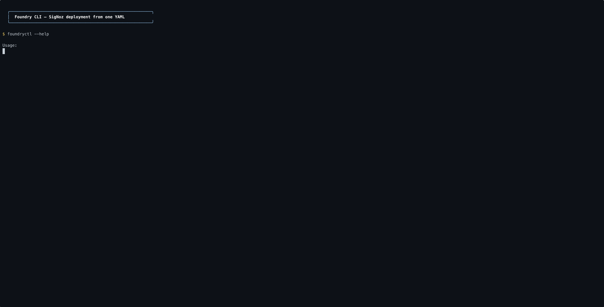

<h1 align="center" style="border-bottom: none">
    <a href="https://signoz.io" target="_blank">
        
    </a>
    <br>Foundry
</h1>

<p align="center">
 
  <a href="https://golang.org"></a>

<p align="center">Foundry is a centralized hub for <a href="https://signoz.io">SigNoz</a> installation configurations and deployments: <strong>integrations for install</strong>. Select yours, configure, and run SigNoz.</p>

## Overview

Just as a metalworking foundry turns raw materials into finished products, Foundry forges your deployment from a single configuration and casts SigNoz to fit your environment.

Foundry abstracts away the complexities of the installation process so you can spend time *using* SigNoz rather than *installing* it.

<p align="center">
  
</p>

## Features

- **Multi-platform support**: Deploy SigNoz using Docker Compose, Systemd (bare metal), or Render for flexible installation across environments.
- **Single configuration file**: Configure your entire SigNoz stack with one concise file.
- **Automatic dependency management**: Handles inter-service dependencies
- **Tool validation**: Verify prerequisites before deployment

## Quick start

**1. Install foundryctl**

You can install `foundryctl` by downloading the latest release directly from [GitHub Releases](https://github.com/signoz/foundry/releases). To quickly get the correct binary for your architecture via the command line, run:

```bash
curl -L https://github.com/SigNoz/foundry/releases/latest/download/foundry_linux_$(uname -m | sed 's/x86_64/amd64/g' | sed 's/aarch64/arm64/g').tar.gz -o foundry.tar.gz
tar -xzf foundry.tar.gz
```

After extracting, use `foundryctl` from the unpacked directory:

```bash
./foundry/bin/foundryctl <COMMAND> <OPTIONS>
```

**2. Create a Casting**

Create a `casting.yaml` file (see [How to write a casting](docs/casting.md) for the full guide). Minimal example:

```yaml
apiVersion: v1alpha1
metadata:
  name: signoz
spec:
  deployment:
    mode: docker
    flavor: compose
```

**3. Deploy**

```bash
foundryctl cast -f casting.yaml
```
## The Foundry Model

Foundry uses a metalworking metaphor: you define a **Casting**, which contains **Moldings** (components), and Foundry **forges** them into **Pours** (generated files).

```mermaid
graph LR
    A[📋 casting.yaml<br/>Single Config File] --> B[🔧 foundryctl gauge<br/>Validate Tools]
    B --> C[⚒️ foundryctl forge<br/>Generate Deployment Files]
    C --> D[🏺 pours/<br/>compose.yaml + configs]

    D --> E[🔥 foundryctl cast<br/>Deploy]
    E --> F[⚙️ Docker Compose /<br/>Systemd /<br/>Cloud Platform]
    F --> G[✨ SigNoz Running<br/>ClickHouse, PostgreSQL,<br/>OTel Collector, SigNoz UI]

    style A fill:#FF9900,stroke:#E68A00,stroke-width:3px,color:#000
    style D fill:#FDB44B,stroke:#E68A00,stroke-width:3px,color:#000
    style G fill:#4E9FFF,stroke:#2A7FD8,stroke-width:3px,color:#fff
    style B fill:#1F1F1F,stroke:#FF9900,stroke-width:2px,color:#fff
    style C fill:#1F1F1F,stroke:#FF9900,stroke-width:2px,color:#fff
    style E fill:#1F1F1F,stroke:#FF9900,stroke-width:2px,color:#fff
    style F fill:#2D2D2D,stroke:#4E9FFF,stroke-width:2px,color:#fff
```


### Casting

A Casting is a complete SigNoz deployment definition: one YAML file that Foundry merges with built-in defaults. For a step-by-step guide (metadata, deployment target, moldings, config, and examples), see **[How to write a casting](docs/casting.md)**.

### Examples

| Deployment | Example |
|------------|---------|
| Docker Compose | [examples/docker/compose/](examples/docker/compose/) |
| Systemd (binary) | [examples/systemd/binary/](examples/systemd/binary/) |
| Render Blueprint | [examples/render/blueprint/](examples/render/blueprint/) |

### Moldings

**Moldings** are the individual components that make up a SigNoz deployment:

| Molding | Implementation |
|---------|----------------|
| **TelemetryStore** | ClickHouse |
| **TelemetryKeeper** | ClickHouse Keeper |
| **MetaStore** | PostgreSQL, SQLite |
| **Ingester** | SigNoz OTel Collector |
| **SigNoz** | SigNoz |

### Pours

**Pours** are the generated deployment and configuration files. When you run `forge`, Foundry creates the `pours/` directory containing everything needed to run SigNoz.

```
pours/
└── deployment/
    ├── compose.yaml
    └── configs/
        ├── ingester/
        │   ├── ingester.yaml
        │   └── opamp.yaml
        ├── telemetrykeeper/
        │   └── keeper-0.yaml
        └── telemetrystore/
            ├── config.yaml
            └── functions.yaml
```

## CLI reference

```
Usage:
  foundryctl [command]

Available Commands:
  gauge       Gauge whether required tools are available
  forge       Forge configuration and deployment files
  cast        Cast to the target environment
  gen         Generate example files for all supported deployments
  help        Help about any command

Flags:
  -d, --debug          Enable debug mode
  -f, --file string    Path to the Casting configuration file (default "casting.yaml")
  -p, --pours string   Directory for Pours (default "./pours")
  -h, --help           Help for foundryctl
```

### gauge

Validates that all required tools are installed for your deployment mode:

```bash
foundryctl gauge -f casting.yaml
```

### forge

Generates deployment and configuration files based on your Casting:

```bash
foundryctl forge -f casting.yaml -p ./pours
```

### cast

Deploys SigNoz to your target environment. Runs `gauge` and `forge` automatically unless skipped:

```bash
foundryctl cast -f casting.yaml

# Skip gauge check
foundryctl cast --no-gauge

# Skip forge (use existing Pours)
foundryctl cast --no-forge
```

### gen

Generates example Casting configurations for all supported deployment modes:

```bash
foundryctl gen
```

## What's next

- [How to write a casting](docs/casting.md): step-by-step guide to casting files
- [Example configurations](examples/): Docker, systemd, and Render
- [SigNoz documentation](https://signoz.io/docs/): learn more about SigNoz
- [SigNoz Slack](https://signoz.io/slack): community and support

## How can I get help?

- **Issues**: [GitHub Issues](https://github.com/signoz/foundry/issues)
- **Documentation**: [SigNoz Docs](https://signoz.io/docs/)
- **Community**: [SigNoz Slack](https://signoz.io/slack)

**Made with ❤️ for the SigNoz community**