<h1 align="center" style="border-bottom: none">
    <a href="https://o11y.hanzo.ai" target="_blank">
        
    </a>
</p>

<h1 align="center" style="border-bottom: none">Foundry</h1>

<p align="center">

  <a href="https://golang.org"></a>

<p align="center">Foundry is a centralized hub for <a href="https://o11y.hanzo.ai">Hanzo O11y</a> installation configurations and deployments: <strong>integrations for install</strong>. Select yours, configure, and run Hanzo O11y.</p>

## Overview

Just as a metalworking foundry turns raw materials into finished products, Foundry forges your deployment from a single configuration and casts Hanzo O11y to fit your environment.

Foundry abstracts away the complexities of the installation process so you can spend time *using* Hanzo O11y rather than *installing* it.

<p align="center">
  
</p>

## Features

- **Multi-platform support**: Deploy Hanzo O11y using Docker Compose, Systemd (bare metal), or Render for flexible installation across environments.
- **Single configuration file**: Configure your entire Hanzo O11y stack with one concise file.
- **Automatic dependency management**: Handles inter-service dependencies
- **Tool validation**: Verify prerequisites before deployment

## Quick start

**1. Install foundryctl**

You can install `foundryctl` by downloading a release from [GitHub Releases](https://github.com/hanzoai/o11y-foundry/releases).

To quickly get the correct binary for your architecture via the command line, run

**Linux:**

```bash
curl -L "https://github.com/Hanzo O11y/foundry/releases/latest/download/foundry_linux_$(uname -m | sed 's/x86_64/amd64/g' | sed 's/aarch64/arm64/g').tar.gz" -o foundry.tar.gz
tar -xzf foundry.tar.gz
```

See [Getting Started](docs/getting-started.md) for manual install options and PATH setup.

```bash
curl -L "https://github.com/Hanzo O11y/foundry/releases/latest/download/foundry_darwin_$(uname -m | sed 's/x86_64/amd64/g' | sed 's/arm64/arm64/g').tar.gz" -o foundry.tar.gz
tar -xzf foundry.tar.gz
```

**Windows (PowerShell):**

```bash
$ARCH = if ($env:PROCESSOR_ARCHITECTURE -eq "ARM64") { "arm64" } else { "amd64" }
Invoke-WebRequest -Uri "https://github.com/Hanzo O11y/foundry/releases/latest/download/foundry_windows_${ARCH}.tar.gz" -OutFile foundry.tar.gz -UseBasicParsing
tar -xzf foundry.tar.gz
```

After extracting, use `foundryctl` from the unpacked directory:

```bash
./foundry/bin/foundryctl <COMMAND> <OPTIONS>
```

**2. Create a Casting**

Create a `casting.yaml` file (see [How to write a casting](docs/casting.md) for the full guide). Minimal example:

```yaml
apiVersion: v1alpha1
metadata:
  name: o11y
spec:
  deployment:
    mode: docker
    flavor: compose
```

**3. Deploy**

```bash
foundryctl cast -f casting.yaml
```

Foundry uses a metalworking metaphor: you define a **Casting**, which contains **Moldings** (components), and Foundry **forges** them into **Pours** (generated files).

```mermaid
graph LR
    A[📋 casting.yaml<br/>Single Config File] --> B[🔧 foundryctl gauge<br/>Validate Tools]
    B --> C[⚒️ foundryctl forge<br/>Generate Deployment Files]
    C --> D[🏺 pours/<br/>compose.yaml + configs]

    D --> E[🔥 foundryctl cast<br/>Deploy]
    E --> F[⚙️ Docker Compose /<br/>Systemd /<br/>Cloud Platform]
    F --> G[✨ Hanzo O11y Running<br/>ClickHouse, PostgreSQL,<br/>OTel Collector, Hanzo O11y UI]

    style A fill:#FF9900,stroke:#E68A00,stroke-width:3px,color:#000
    style D fill:#FDB44B,stroke:#E68A00,stroke-width:3px,color:#000
    style G fill:#4E9FFF,stroke:#2A7FD8,stroke-width:3px,color:#fff
    style B fill:#1F1F1F,stroke:#FF9900,stroke-width:2px,color:#fff
    style C fill:#1F1F1F,stroke:#FF9900,stroke-width:2px,color:#fff
    style E fill:#1F1F1F,stroke:#FF9900,stroke-width:2px,color:#fff
    style F fill:#2D2D2D,stroke:#4E9FFF,stroke-width:2px,color:#fff
```


### Casting

A Casting is a complete Hanzo O11y deployment definition: one YAML file that Foundry merges with built-in defaults. For a step-by-step guide (metadata, deployment target, moldings, config, and examples), see **[How to write a casting](docs/casting.md)**.

### Examples

| Deployment | Example |
|------------|---------|
| Docker Compose | [examples/docker/compose/](docs/examples/docker/compose/) |
| Systemd (binary) | [examples/systemd/binary/](docs/examples/systemd/binary/) |
| Render Blueprint | [examples/render/blueprint/](docs/examples/render/blueprint/) |

### Moldings

**Moldings** are the individual components that make up a Hanzo O11y deployment:

| Molding | Implementation |
|---------|----------------|
| **TelemetryStore** | ClickHouse |
| **TelemetryKeeper** | ClickHouse Keeper |
| **MetaStore** | PostgreSQL, SQLite |
| **Ingester** | Hanzo O11y OTel Collector |
| **Hanzo O11y** | Hanzo O11y |

### Pours

**Pours** are the generated deployment and configuration files. When you run `forge`, Foundry creates the `pours/` directory containing everything needed to run Hanzo O11y.

```
  +-------------------------------------------------------------+
  |                       casting.yaml                          |
  |              your single deployment config                  |
  +-----------------------------+-------------------------------+
                                |
                +---------------+---------------+
                |               |               |
                v               v               v
         +-----------+  +-----------+  +----------------+
         |   gauge   |  |   forge   |  |     cast       |
         |-----------|  |-----------|  |----------------|
         | validate  |  | generate  |  | gauge + forge  |
         | prereqs   |  | files     |  | + deploy       |
         +-----------+  +-----+-----+  +-------+--------+
                              |                 |
                              v                 |
         +----------------------------------+   |
         |             pours/               |   |
         |----------------------------------|   |
         |  compose.yaml    manifests/      |   |
         |  values.yaml     configs/        |   |
         |  render.yaml     *.tf.json       |   |
         +-----------------+----------------+   |
                           |                    |
                           +----------+---------+
                                      v
  +-------------------------------------------------------------+
  |                      SigNoz Running                         |
  |-------------------------------------------------------------|
  |  Docker Compose - Swarm - Systemd - Kubernetes - ECS        |
  |  Render - Railway - Coolify                                 |
  +-------------------------------------------------------------+
```

`foundryctl cast` runs the full pipeline (gauge + forge + deploy) in one step.

| Term | What it means |
| --- | --- |
| **Casting** | Your deployment config. One YAML file describing what you want. [Learn more](docs/concepts/casting.md) |
| **Moldings** | The SigNoz components (ClickHouse, PostgreSQL, OTel Collector, etc.) that Foundry configures for you. [Learn more](docs/concepts/moldings.md) |
| **Pours** | The generated output files in `pours/`. Structure varies by deployment mode. See [examples](docs/examples/) |

## Examples

| Platform | Mode | Flavor | Example |
| --- | --- | --- | --- |
| - | docker | compose | [docker/compose](docs/examples/docker/compose/) |
| - | docker | swarm | [docker/swarm](docs/examples/docker/swarm/) |
| - | kubernetes | helm | [kubernetes/helm](docs/examples/kubernetes/helm/) |
| - | kubernetes | kustomize | [kubernetes/kustomize](docs/examples/kubernetes/kustomize/) |
| - | systemd | binary | [systemd/binary](docs/examples/systemd/binary/) |
| ecs | ec2 | terraform | [ecs/ec2/terraform](docs/examples/ecs/ec2/terraform/) |
| coolify | - | stack | [coolify/stack](docs/examples/coolify/stack/) |
| railway | - | template | [railway/template](docs/examples/railway/template/) |
| render | - | blueprint | [render/blueprint](docs/examples/render/blueprint/) |

## CLI reference

```
foundryctl [command]

Commands:
  gauge       Validate required tools for your deployment mode
  forge       Generate deployment and configuration files
  cast        Full pipeline: gauge + forge + deploy
  gen         Generate example casting files for all modes

Flags:
  -d, --debug          Enable debug logging
  -f, --file string    Casting file path (default "casting.yaml")
  -p, --pours string   Output directory (default "./pours")
```

```bash
# Validate tools
foundryctl gauge -f casting.yaml

# Generate files only
foundryctl forge -f casting.yaml

Generates deployment and configuration files based on your Casting:

```bash
foundryctl forge -f casting.yaml -p ./pours
```

### cast

Deploys Hanzo O11y to your target environment. Runs `gauge` and `forge` automatically unless skipped:

```bash
foundryctl cast -f casting.yaml

# Generate examples for all deployment modes
foundryctl gen
```

See [CLI Reference](docs/reference/cli.md) for the full command reference with all flags and examples.

## What's next

- [How to write a casting](docs/casting.md): step-by-step guide to casting files
- [Example configurations](docs/examples/): Docker, systemd, and Render
- [Hanzo O11y documentation](https://o11y.hanzo.ai/docs/): learn more about Hanzo O11y
- [Hanzo O11y Slack](https://o11y.hanzo.ai/slack): community and support

## How can I get help?

- **Issues**: [GitHub Issues](https://github.com/hanzoai/o11y-foundry/issues)
- **Documentation**: [Hanzo O11y Docs](https://o11y.hanzo.ai/docs/)
- **Community**: [Hanzo O11y Slack](https://o11y.hanzo.ai/slack)

**Made with ❤️ for the Hanzo O11y community**